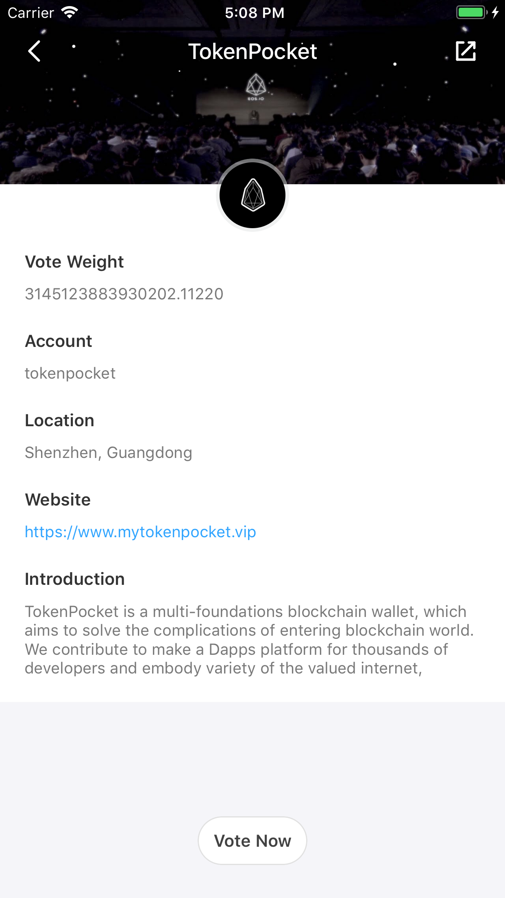
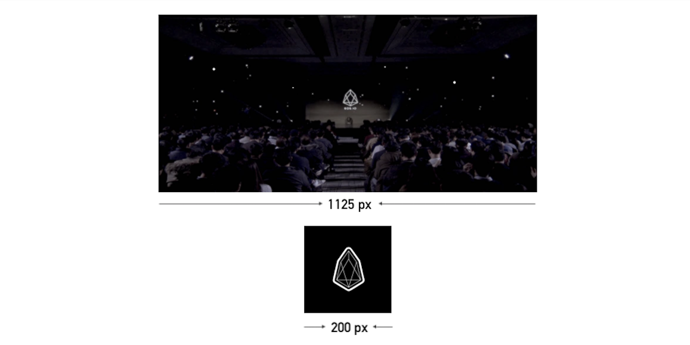

# EOS-SP-Profile
The purpose of the repo is to make users know more about EOSIO. SP means Super Proxy, here is the SP info display Example: 

## Images design 
- cover size: 1125x420 png
- logo size: 200x200 png

## Copyright

2018&copy;TokenPocket
